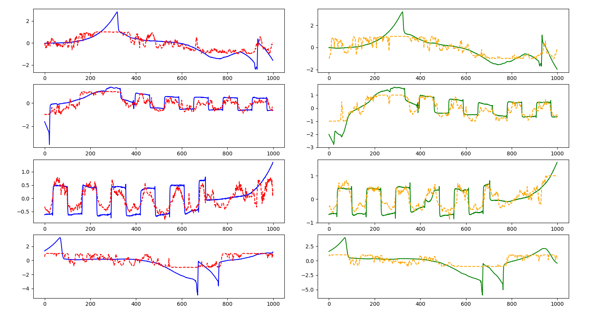
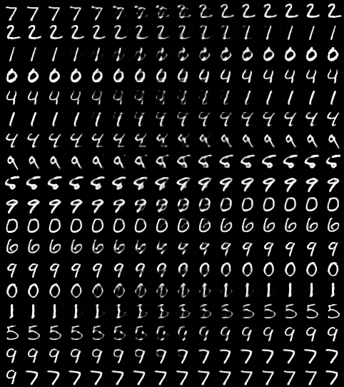

# Autoencoders-demo

This repository contains a demo of autoencoders. [Source](https://github.com/dariocazzani/pytorch-AE)

## How to run

```sh
python train.py --config-name <config>
```

where `<config>` is a .yaml file in the `configs` folder.
- use `ecg_config.yaml` for 1D signal data
- `config.yaml` for MNIST/CIFAR10 images

## Expected results
**LTAFDB**:

**blue/green**: original signal

**red/orange**: reconstructed signal

channel 0 on the left, channel 1 on the right

**MNIST**:


## Code Style

This repository uses pre-commit hooks with forced python formatting ([black](https://github.com/psf/black),
[flake8](https://flake8.pycqa.org/en/latest/), and [isort](https://pycqa.github.io/isort/)):

```sh
pip install pre-commit
pre-commit install
```

Whenever you execute `git commit` the files altered / added within the commit will be checked and corrected.
`black` and `isort` can modify files locally - if that happens you have to `git add` them again.
You might also be prompted to introduce some fixes manually.

To run the hooks against all files without running `git commit`:

```sh
pre-commit run --all-files
```
